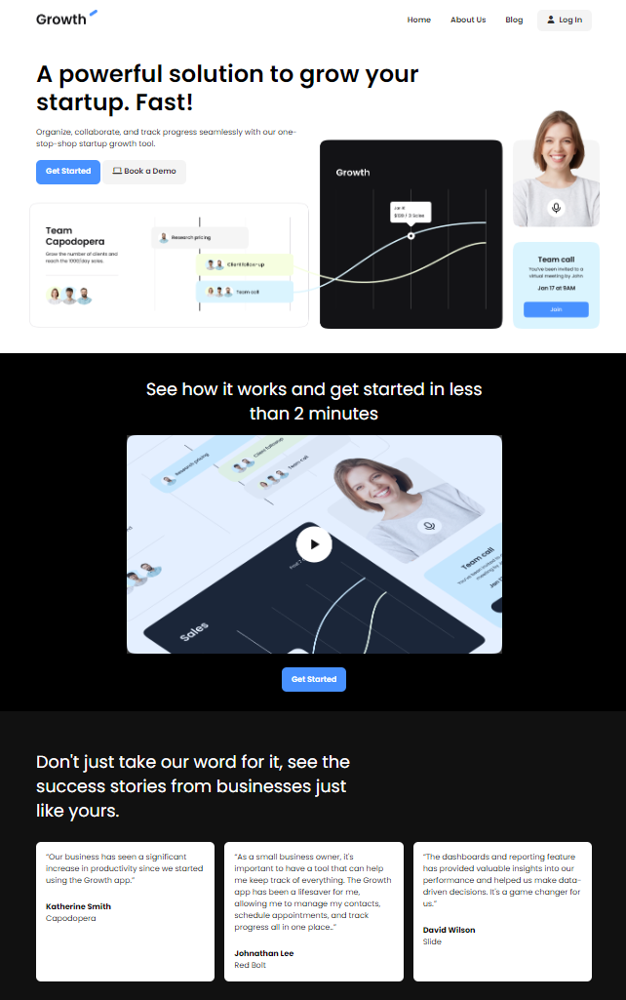

# SaaS Company Landing Page

This is an exercise from a [YouTube HTML/CSS tutorial](https://www.youtube.com/watch?v=HXYZxVbWkjc&list=PPSV) by [Traversy Media](https://#) on building a professional website for beginners.

This project is from the [iCodeThis](https://icodethis.com/?ref=traversy) challenge website and does not use any frameworks or libraries. It is built with pure HTML and CSS and a bit of JavaScript for the hamburger menu and the FAQ(Frequently Asked Questions) accordion.

